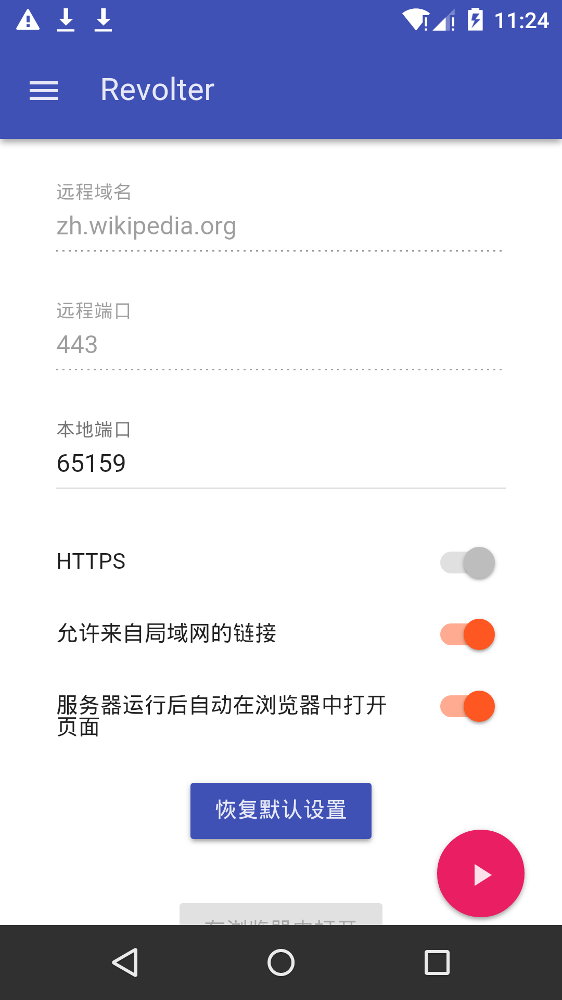
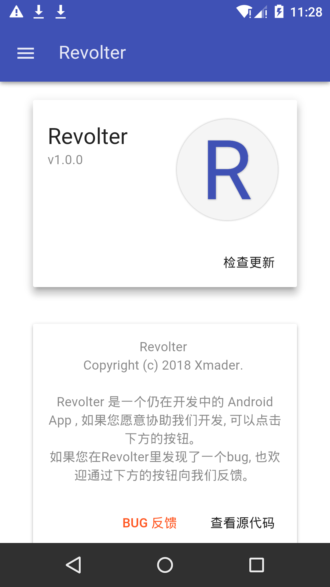

# Revolter

> 对 SNI RST 说不！

> 一个用于访问中文维基百科和Pixiv等被GWF用SNI检测方式重置连接的站点的 Android App

 

## 快速上手

1. 安装并打开应用程序
2. 点击右下角的圆形运行按钮

> 是的，基本的使用方法这就结束了。
> 您现在就可以在弹出的浏览器页面中畅快地浏览中文维基百科了。

## 下载

[Releases](https://github.com/Xmader/Revolter/releases)

## 自行构建

[请参考这里](tools/init.sh)

## 屏幕截图

> 这是在 `v1.0.0` 版本时的屏幕截图, 不能反映后续版本的更改

## License

MIT
